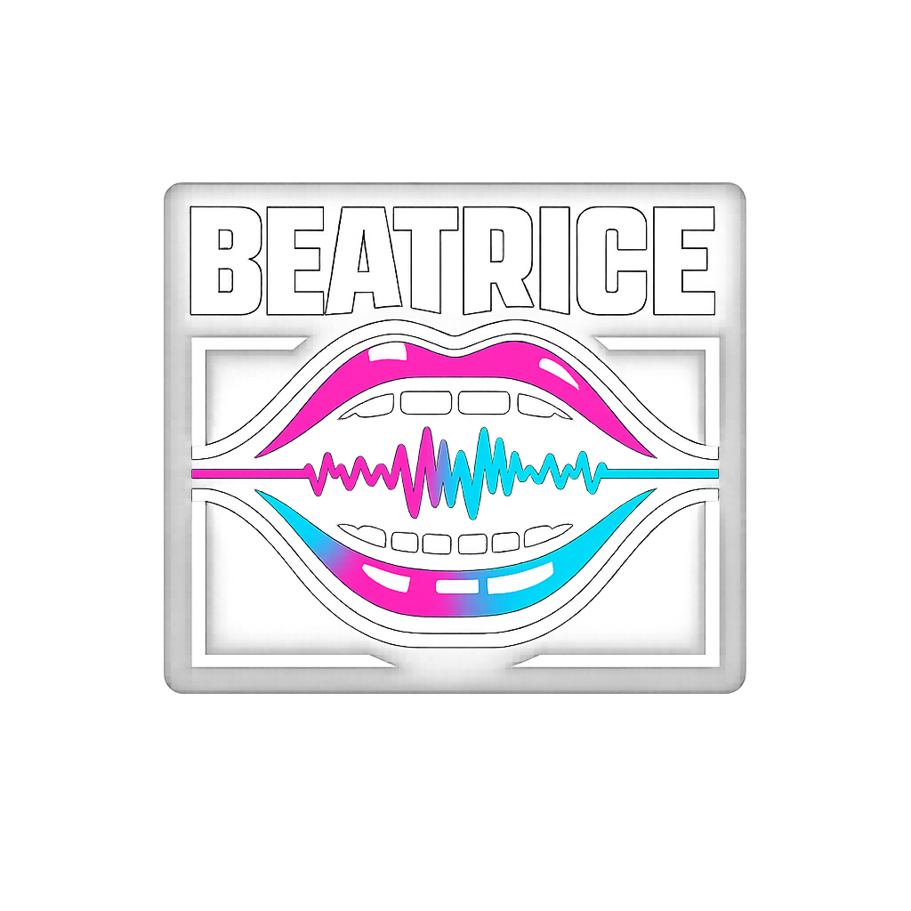
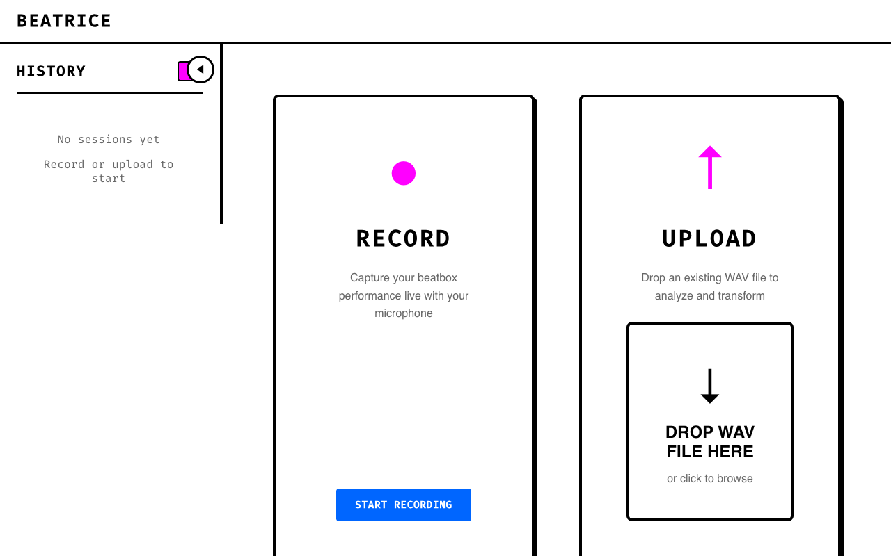
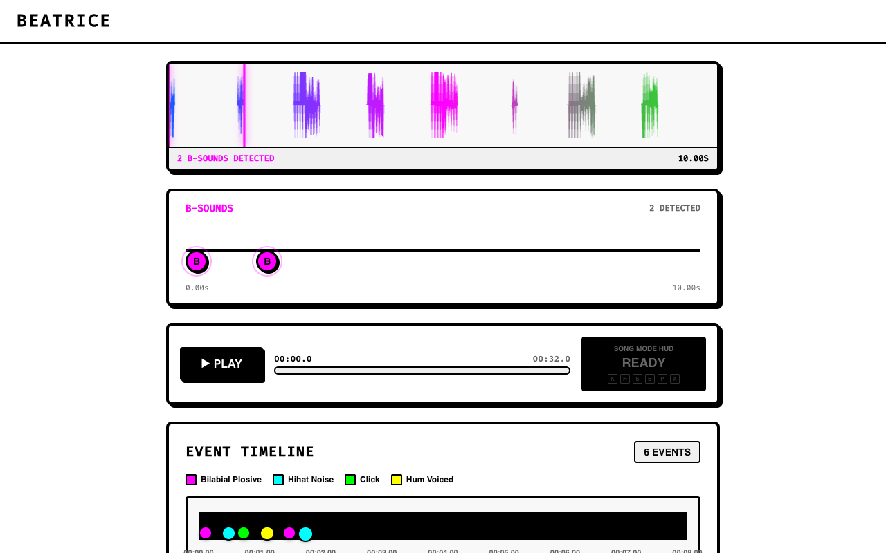
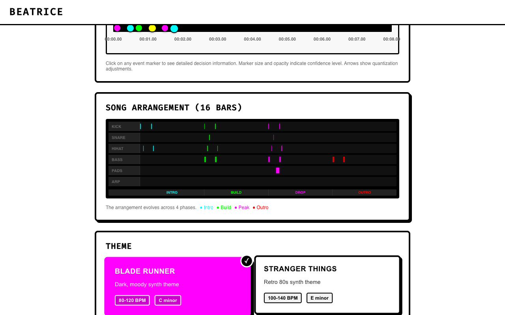
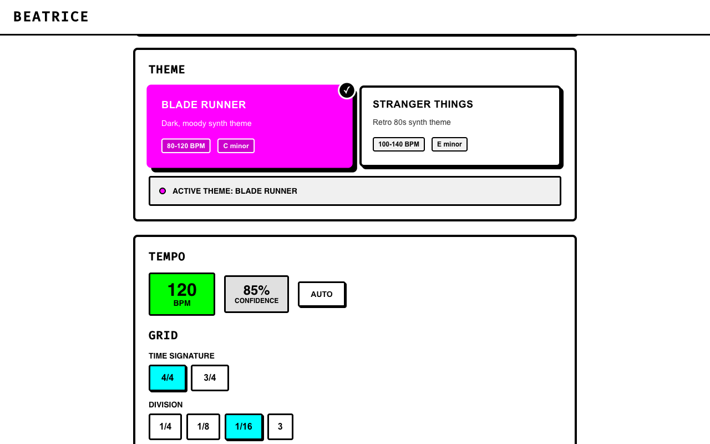
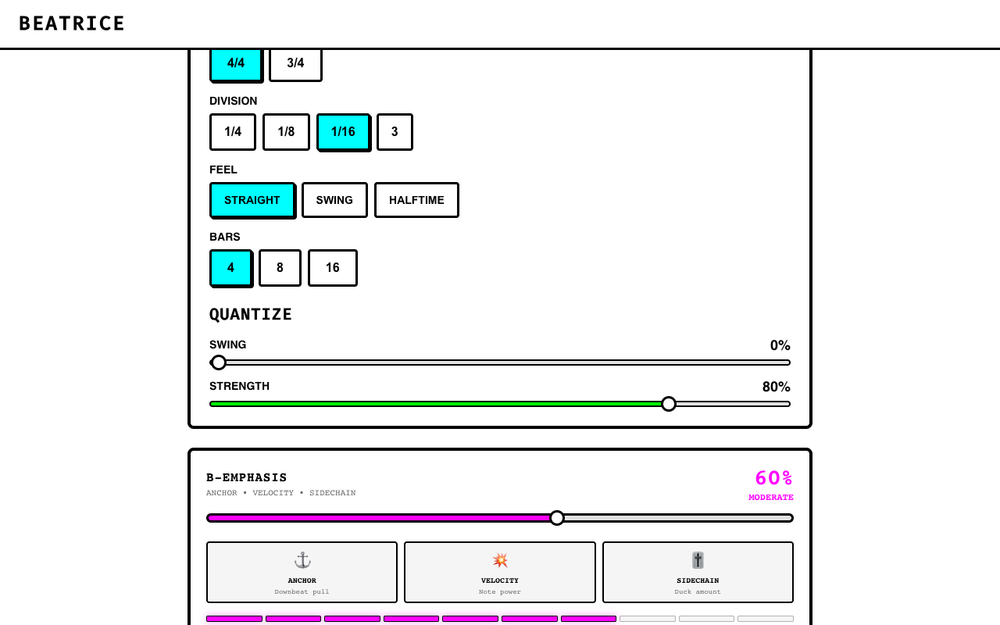
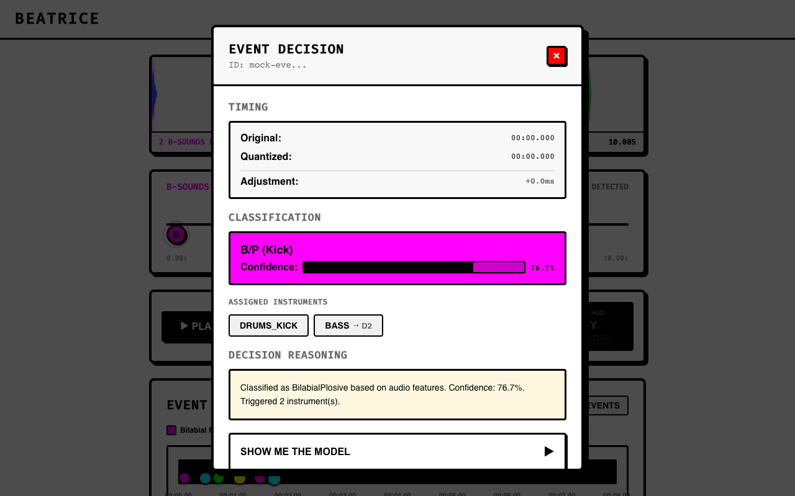

# Beatrice

> Beatbox into your mic. Get a synth beat out.

Beatrice is a desktop app that transforms beatbox performances into harmonically intelligent synthesizer arrangements. You provide the rhythm with your mouth — kicks, hi-hats, snares, and hums — and Beatrice detects each sound, classifies it, estimates your tempo, and arranges everything into a multi-track composition that follows real chord progressions.

<p align="center">
  
</p>

## How It Works

1. **Record or upload** a beatbox performance (WAV)
2. **Beatrice listens** — onset detection finds every sound, classification identifies what each one is
3. **Tempo is estimated** from your natural rhythm
4. **Events are quantized** to a musical grid with swing and feel controls
5. **A harmonic arrangement is generated** — bass walks chord progressions, pads play triads, arps follow your rhythm
6. **Song Mode** turns your 4-bar loop into a 16-bar evolving track with intro, build, drop, and outro
7. **Export as MIDI** for use in any DAW, or preview in-app with layered WebAudio synthesis

## Screenshots

### Home Screen

Record live, upload a WAV file, or try the built-in demo.

### Results — Waveform & Playback

Color-coded waveform visualization, B-sound markers, Song Mode HUD showing the active section (Intro/Build/Drop/Outro), and playback controls.

### Song Arrangement (16 Bars)

Visual arrangement showing all instrument lanes across 4 Song Mode phases. The harmonic engine walks the bass through the theme's chord progression (Dm → Bb → F → C for Blade Runner).

### Groove Controls

Tempo (auto-detected), time signature, grid division, feel (straight/swing/halftime), quantize strength, and the B-Emphasis slider that controls how strongly your kick sounds drive the bass synth.

### Export

Export MIDI for any DAW (Ableton, Logic, FL Studio) or preview audio with current theme settings.

### Explainability — Event Decision Card

Click any detected event to see exactly why Beatrice classified it that way — timing adjustment, confidence level, which instruments were triggered, and the actual musical notes assigned (e.g., BASS → D2).

## Sound Classification

Beatrice recognizes 4 types of beatbox sounds:

| Your Sound | Class | Triggers | What It Detects |
|-----------|-------|----------|---------|
| "B" or "P" (lip pop) | BilabialPlosive | Kick drum + Bass synth | Low frequency burst, strong low-band energy |
| "TS" or "SSH" (teeth hiss) | HihatNoise | Hi-hat | High frequency noise, high ZCR |
| "T" or "K" (tongue click) | Click | Snare drum | Mid-frequency transient, sharp crest factor |
| Humming / "mmm" | HumVoiced | Pad chord (triad) | Sustained tone, low crest factor |

### Real-World Accuracy

Tested on 3 real human recordings (laptop mic, untrained user):

- **Detection rate**: 93.8% (43 events across 3 recordings)
- **Classification accuracy**: 100% of detected events matched user intent
- **False positives**: 0 confirmed
- **Tempo estimation**: Within 2% of actual tempo
- **Best classes**: BilabialPlosive (97-100%), HumVoiced (100%)
- **Weakest class**: HihatNoise (64-86% confidence — sibilants are quiet on laptop mics)

## Themes

Themes define the harmonic personality of the output:

| Theme | Key | Progression | Character |
|-------|-----|------------|-----------|
| **Blade Runner** | D minor | Dm → Bb → F → C | Dark, atmospheric, Vangelis-inspired |
| **Stranger Things** | E minor | Em → C → G → D | Retro 80s synth |

The bass line follows the chord progression with root-fifth alternation. Pad chords resolve to the active triad. Arpeggios can be driven by your hi-hat rhythm (ArpDrive mode).

## Song Mode

When you hit Play, Beatrice doesn't just loop your beat — it builds a full 16-bar arrangement:

| Section | Bars | What Plays |
|---------|------|------------|
| **Intro** | 1-4 | Kick + Hi-hat only |
| **Build** | 5-8 | + Snare + Bass (harmonic progression enters) |
| **Drop** | 9-12 | Full arrangement with Pads + Arp |
| **Outro** | 13-16 | Bass only, fading out |

A 4-second beatbox becomes a 30-second evolving track.

## Tech Stack

- **Frontend**: React 19, TypeScript, Zustand, Three.js (R3F), Framer Motion, Vite 7
- **Backend**: Rust (Tauri 2), SQLite (rusqlite), hound (WAV), cpal (recording), realfft (FFT), midly (MIDI), fundsp (DSP)
- **Audio**: WebAudio API with layered synthesis, convolution reverb, ping-pong delay, sidechain ducking
- **Design**: Neo-brutalist CSS with bold borders and high-contrast colors

## Getting Started

### Browser mode (frontend only, mock backend)
```bash
npm install
./run.sh
# Opens at http://localhost:1420 — click "TRY DEMO" to see the full pipeline
```

### Native mode (full Tauri app with Rust backend)
```bash
npm install
./run.sh tauri
# Requires Rust 1.77+ toolchain
```

### Analyze a WAV file directly
```bash
cd src-tauri
cargo run --bin analyze -- path/to/your/beatbox.wav
```

### Run tests
```bash
cd src-tauri
cargo test    # 121+ unit tests + 8 integration tests
```

### Generate deterministic test audio
```bash
node scripts/generate-test-audio.mjs
```

## Architecture

```
src/                          # React frontend
  App.tsx                     # Pipeline orchestration, state machine
  hooks/
    useAudioPlayback.ts       # WebAudio synthesis, Song Mode, velocity-to-filter
    useAudioRecorder.ts       # Mic recording via Tauri IPC
  components/
    Explainability/           # Timeline, DecisionCard, ArrangementLanes
    Theme/                    # Theme selector with harmonic metadata
    Groove/                   # Grid, quantize, tempo controls

src-tauri/src/                # Rust backend
  audio/                      # WAV ingestion, onset detection (spectral flux +
                              # broadband energy), feature extraction
  events/                     # Heuristic classifier (spectral centroid, ZCR,
                              # band energy, crest factor) + KNN calibration
  groove/                     # Tempo estimation (all-to-all IOI), musical grid,
                              # quantization with swing
  arranger/                   # Harmonically-aware arrangement (chord-resolved
                              # bass, triadic pads, rhythmic arp puppeteering)
  themes/                     # Scale families, chord progressions, bass/arp
                              # patterns, FX profiles
  render/                     # Synthesis engine (placeholder — WebAudio active)
  state/                      # SQLite persistence, file storage, JSONL traces
```

## License

MIT
